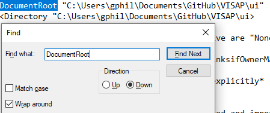

# VISAP
This project aims to be a revamp of https://github.com/softvis-research/Getaviz. In particular, it aims to reduce bloat in its source code while merging a lot of the features of Getaviz that were previously built separately through the efforts of many individual contributors.

## Current State
The project is currently in a pre-development phase. Porting of functionality from Getaviz is still ongoing, and while we have a rough idea of where we want to go, many important design decisions are yet to be made.

## Installation

### Displaying a Model in the Browser

| :warning: WARNING                                                                                                                                                                                                      |
|:-----------------------------------------------------------------------------------------------------------------------------------------------------------------------------------------------------------------------|
| Before you get started with displaying the model in the browser, you will need a node_modules folder in the ui folder. Unfortunately, we are currently unable to upload this folder to the repository.                 |

After executing all the steps, two files will have been generated for you: model.html and metaData.json.

To display the model in the browser, first, navigate to the folder ui/data. Create a folder with a fitting name, for example "Test". Create a subfolder named "model". Copy both the model.html file and the metaData.json file into the model folder.

Next, you will need a webserver. We recommend [XAMPP](https://www.apachefriends.org/download.html).

Click on the config for Apache and select Apache (httpd.conf). Change the path behind DocumentRoot and <Directory to match the location of the ui folder.

Save the config, close it, and start the Apache Module.

You should now be able to view the visualization in the browser.
Enter the URL http://localhost/index.php?setup=ABAP/PackageExplorer&model={folderName}

Instead of {folderName}, use the name of the folder where your model sits, for example http://localhost/index.php?setup=ABAP/PackageExplorer&model=Test

The visualization will look similar to this:

## Documentation
The development team actively uses and maintains https://miro.com/app/board/uXjVOGFnA-M=/ for project coordination and documentation. The Miro board also includes instructions for installation and usage. Access requests will generally be accepted. Most documentation is currently available in German only.

If you need help or have any suggestions, we appreciate your interest in the project, and hope you will file an issue or message the contributors directly.
