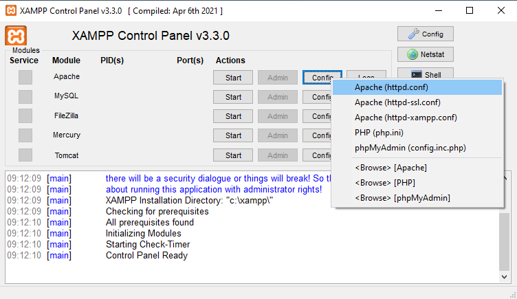
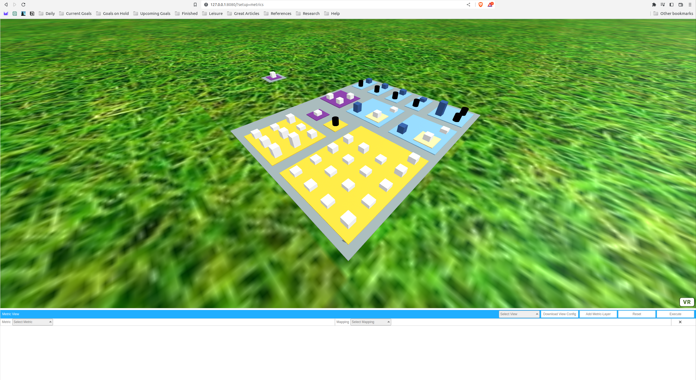

# VISAP

This project aims to be a revamp of [Getaviz](https://github.com/softvis-research/Getaviz). In particular, it aims to reduce bloat in its source code while merging a lot of the features of Getaviz that were previously built separately through the efforts of many individual contributors.

## Current State

The project is currently in a pre-development phase. Porting of functionality from Getaviz is still ongoing, and while we have a rough idea of where we want to go, many important design decisions are yet to be made.

## Installation

### Compiling the Generator

This project requires a JDK version of 12 or higher.

The generator project is built using Maven. Open the project in your IDE of choice by importing the pom.xml file in the generator/ directory and then building the project.

### Initializing the Graph Database

VISAP uses a local Neo4j graph database to generate its model. Download a current version of Neo4j, then set up a new local project there.

Make the following changes to the configuration of that database (… > Settings):
- Comment out ``dbms.directories.import=import`` by prepending #
- De-comment ``dbms.security.allow_csv_import_from_file_urls=true`` by removing the leading #

In addition, for the sake of simplicity, let's also disable authentication for now:
- De-comment ``dbms.security.auth_enabled=false`` by removing the leading #

If you want to re-enable authentication later, check out the section on [Configuration](#configuration).

Then, start the database. The authorization being disabled may cause warnings on start-up, which can be dismissed.

### Generating a Model

- Ensure that the Neo4J database is running
- Place input CSV files inside the directory ``generator/input/``. This directory is meant as a place to store all your model data inside appropriately named sub-directories. It also contains an example sub-directory to get you started.
- Execute the file ``generator/src/main/java/org.visap.generator/steps/LoaderStep.java``. This will place the initial data in the local graph database. Any previously contained data is overwritten!
- Execute the file ``generator/src/main/java/org.visap.generator/steps/AFrameExporterStep.java``. This will run all additional model-generating steps. Depending on the model size, this process can take a few minutes to finish.

The resulting model files (model.html and metaData.json) are placed in the ui/model/yourOutput folder by default. This folder also includes an example sub-directory.

To change your input location, you can change the ``inputCSVFilePath`` property inside the ``generator/properties/Setup.properties`` file. Similarly, to change your output location, you can change the ``mapPath`` property inside the ``generator/properties/Output.properties`` file.

### Displaying a Model in the Browser

After following the instructions in section [Generating a Model](#generating-a-model), two files will have been generated for you: model.html and metaData.json. By default, these will be placed inside ``ui/model/yourOutput/``, but you can specify a different location in your configuration.

Next, you will need a local server. Based on your operating system, we recommend different practices. If these don't work for you, further information about setting up a local server can be found [here](https://aframe.io/docs/1.4.0/introduction/installation.html#use-a-local-server).

### On Windows

Install [XAMPP](https://www.apachefriends.org/download.html).



Click on the config for Apache and select Apache (httpd.conf). Change the path behind ``DocumentRoot`` and in ``<Directory "...">`` to match the location of the ui folder. Alternatively, create a symbolic link to the folder in the existing document root, in which case the symlink name should be inserted correspondingly after "localhost/" for all following localhost URLs.


Save the config, close it, and start the Apache Module.

### On Ubuntu

Install [NPM](https://www.npmjs.com/) and run the command
```bash
npm install -g live-server && live-server
```
inside the UI folder.

### Final Steps

Whichever approach for setting up a local server you used, if things went well, you should now be able to view the visualization in the browser.
Enter the URL ``{localhost}/index.html?setup={setupPath}&model={folderName}``, where ``{localhost}`` is the URL to the webserver, and ``{folderName}`` is the name of the folder that holds the model files (which is going to be yourOutput if you made no changes to the configuration). You can also use ``example`` as the folderName to use an example model. ``{setupPath}`` is where the setup lives inside the ``ui/setups/`` folder. For now, the only available setup is ``minimal``.

When using NPM live-server, our complete URL might be http://127.0.0.1:8080/?setup=minimal&model=Example. When using XAMPP, it might be http://localhost/index.html?setup=minimal&model=Example instead.

The visualization will look similar to this:



## Testing Changes

When testing changes, make sure that your browser doesn't cache previous visits to the localhost.

Refresh the page with Ctrl-F5 to request an uncached version of the page.

Alternatively, disable caching in your browser entirely. In Chrome, open the Developer Tools with F12, select the Network tab, then select the checkbox "Disable Cache". In Firefox, enter ``about:config`` in the address bar, search for ``browser.cache.disk.enable`` and set it to ``false``.

## Documentation
The development team actively uses and maintains a [Miro board](https://miro.com/app/board/uXjVOGFnA-M=/) for project coordination and documentation. Access requests will generally be accepted. Most of the information on the Miro board is currently written in German.

If you need help or have any suggestions, we appreciate your interest in the project, and hope you will file an issue or message the contributors directly.

## Configuration

Configuration files are essential for building projects with different settings, and they can be managed project-wide or locally.

To manage configurations project-wide, you can make changes to the ``generator/properties`` file. These changes will not be ignored by Git. However, if you want to make local changes to your configuration, you can create a new subfolder in the ``generator`` folder called ``user-properties``, and set your configurations there similarly to how you would in ``generator/properties``. All changes made in this folder will be ignored by Git and will overwrite existing configurations.

For example, if you want to specify a password for authentication to Neo4j, you can do so by creating a file ``generator/user-properties/Setup.properties``. In here, write:
```properties
password=123
```
to set your password to 123. Also remember to enable authentication for your Neo4j database again, if you disabled it before.

## Coding Standards

Both Java and JavaScript code roughly follow [1TBS formatting](https://en.wikipedia.org/wiki/Indentation_style#Variant:_1TBS_(OTBS)). Single lines of whitespace (rarely two) can be used to separate logical units in code blocks and source files. Padding out the beginnings and ends of blocks is generally not necessary, though you might still find it in older code.

JavaScript code is indented with tabs. No concessions need to be made for compatibility with older browsers. As such, modern JS features are recommended to be used where applicable. This includes using ``let`` and ``const`` over ``var`` where possible. The file ``ui/scripts/CanvasHover/CanvasHoverController.js`` is representative of what style and formatting should resemble.

Java code is indented with 4 spaces. Features up to relatively recent Java versions are fair game, but check with people before pushing the current minimum version requirements (under [Compiling the Generator](README.md#compiling-the-generator)). Line lengths should stay within 120 characters, line break if necessary. The file ``generator/src/main/java/org/visap/generator/metaphors/metropolis/steps/MetropolisCreator.java`` is representative of what style and formatting should resemble.
